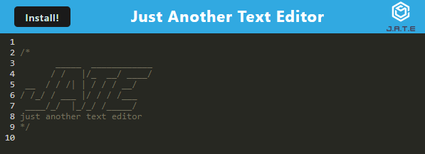
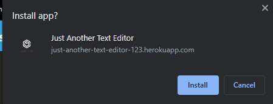

# text-editor

## Description 

### [Deployed Link](https://just-another-text-editor-123.herokuapp.com/).

This is a text editor that utilizes PWA, service workers, webpack, indexed db(IDB), and mongoDB libraires through Heroku. 


## Table of Contents

* [Installation](#installation)
* [Usage](#usage)
* [Credits](#credits)
* [License](#license)


## Installation

Clone or Fork repository into local machine, or use deployed link above

To install necessary dependencies, run the following commands in the root directory : `npm install` or `npm i` 

## Usage 

Use the deployed link above, or if cloned, utilize `npm run start` command in the root directory and go to `http://localhost:3000/`

You will be brought to a page that looks like this:



It is a text editor that color codes for javascript items. It will save and persist upon refresh for each user.

It also utilizes PWAs to allow for an install to be run with service workers offline and locally:



This is possible with the use of webpack, IDB, and service workers through the scripts:

```c++
import { openDB } from 'idb';
// IDB Database
const initdb = async () =>
  openDB('jate', 1, {
    upgrade(db) {
		if (db.objectStoreNames.contains('jate')) {
			console.log('jate database already exists');
			return;
		}
		db.createObjectStore('jate', { keyPath: 'id', autoIncrement: true });
		console.log('jate database created');
    },
  });
```


## Credits

[Nodejs](https://nodejs.org/dist/latest-v16.x/docs/api/)

[Express](https://www.npmjs.com/package/express)

[MongoDB](https://www.mongodb.com/)

[Mongoose](https://mongoosejs.com/)

[Babel](https://babeljs.io/)

[Webpack](https://webpack.js.org/)

[Workbox](https://developer.chrome.com/docs/workbox/)

[IDB](https://www.npmjs.com/package/idb)

[Concurrently](https://www.npmjs.com/package/concurrently)

[CodeMirror](https://codemirror.net/)


## License

 This project is licensed under the MIT license.
[](https://opensource.org/licenses/MIT)
